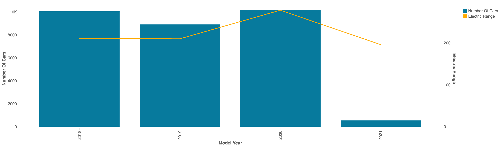

## Exercise 1: Create Combo Chart


#### Dataset

datasets/Electric_Vehicle_Population_Data.csv

#### Queries

Use the same query as in the screencast, pasted below:
```
SELECT *
FROM electric_vehicle_population_data
WHERE `Electric Vehicle Type` = "Battery Electric Vehicle (BEV)"
AND `Model Year` >= 2018
AND `Electric Range` > 0 
```

Only difference in the query compared to the screencast is
that the Model Year filtered for values greater or equal to 2018 instead of 2020.

#### Learning Objective

In this exercise learner will create combo chart a real-life like scenario.
The visualizations are going to be similar to the ones displayed in screencast but they will tell
a different story about the data.

#### Context

In this example, we will ask learner to create a Combo chart in Databricks that displays the electric range
of electric vehicles grouped by different years. They will visualize from 2018 to 2021 how the electric range of
electric vehicles evolved. And after this exercise learner will be able to apply the same techniqueus to any real-world
data set. 

#### Steps to be executed by the student (max 6)

- Run the query in Databricks and click on creating a visualization
- Select combo chart as the visualization type, rename the visualization
- For X column select Model Year, from the X axis tab select Scale(Categorical) to make the visualization better
- For Y columns select 1st, count* and 2nd, Electric Range(Average)
- Format the visualizaiton from the Series tab to make it more appealing
- Save the visualization

#### Exercise question:

According to our visualization how did the electric range of vehiecles changed in between 2018 and 2020.
- It stayed flat between 2018 and 2019 and then increased in 2020
- It increased steadily in between 2018 and 2020
- It decreased in between 2018 and 2020

First option is the correct answer


#### End goal:

