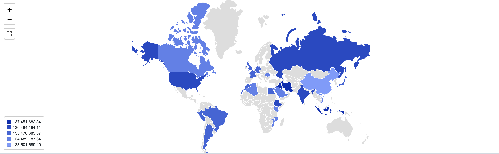

## Exercise 2: Create Map Choropleth Visualization

In this exercise we are going to create a map choropleth visualization to visualize
sum of account balances of customers by country.

#### Dataset

Databricks Sample Datasets:
samples.tpch.customer
samples.tpch.nation

These datasets are available in all Databricks accounts by default.
#### Queries

Use the below query:
```
SELECT
initcap(n_name) as Country,
sum(c_acctbal)
FROM samples.tpch.customer
join samples.tpch.nation where n_nationkey = c_nationkey
GROUP BY 1
```

The result of the query will show sum of account balances of customers by country.

#### Learning Objective

In this exercise learner will create map choropleth visualization to visualize sum of account balances of customers by country.
The visualization is using a different dataset than in the screencast and it uses a different type of map choropleth visualization.

#### Context

In this example, learner will be able to create a map choropleth visualization of countries. This visualization often comes up
in the real world scenarios like, earnings by country, sum of account balances customers by country and so on. Here we are simulating that
real world scenario.

#### Steps to be executed by the student (max 6)

- Run the query in Databricks and click on creating a visualization
- Select map choropleth as the visualization type, rename the visualization
- For Map type select countries
- For geographic column select Country and Geographic Type as Short name 
- Format the visualizaiton so that the N/A values appear as 0
- Save the visualization

#### Exercise question:

According to our visualization which country has the highest sum of account balances.
- USA
- Indonesia
- Russia

Second option Indonesia is the answer


#### End goal:

